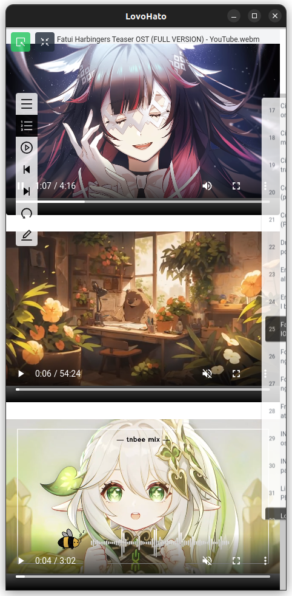
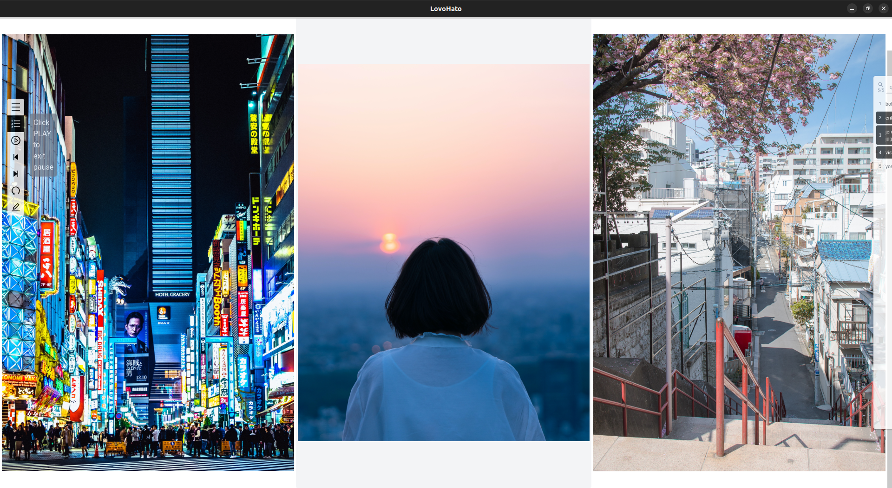
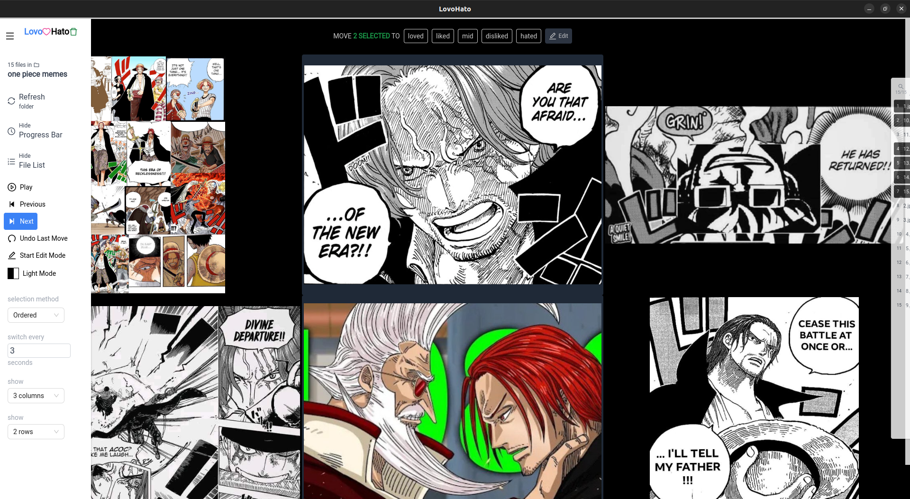
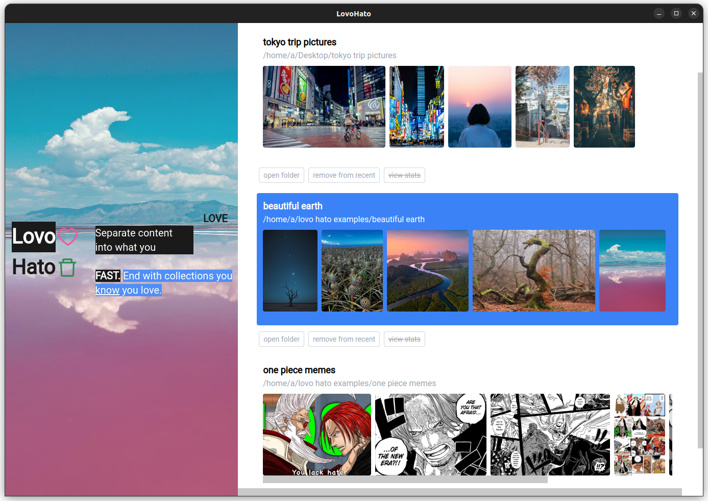
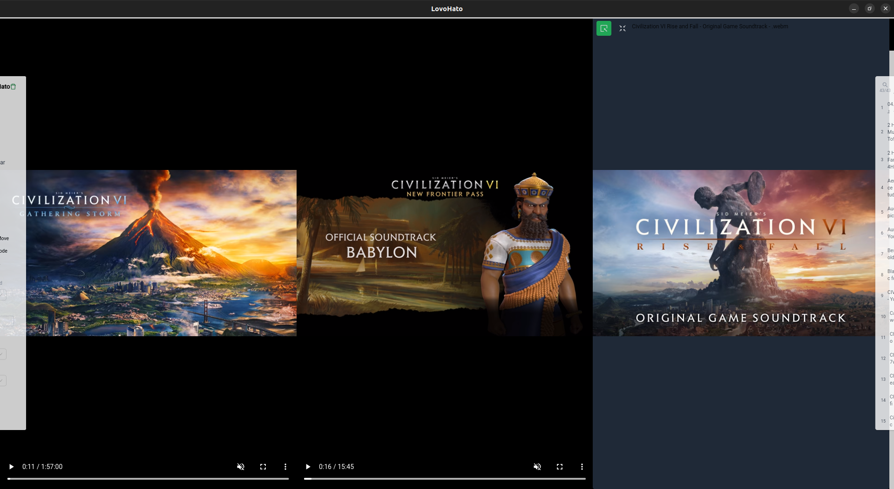

# Problem: You have too much content.

You want to create a 'fine-tuned' set, maybe for AI image generation.

Result: It can be effortful to do so.

LovoHato attempts to provide a simple interface for fast yet easy filtering of media (images, audio and video).

Note: Mainly for personal use, so it will likely be rough around the edges.

Currently supported OS:
 - Linux
 - Windows

